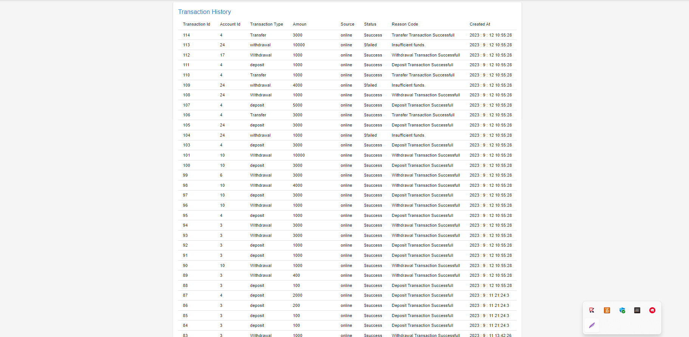
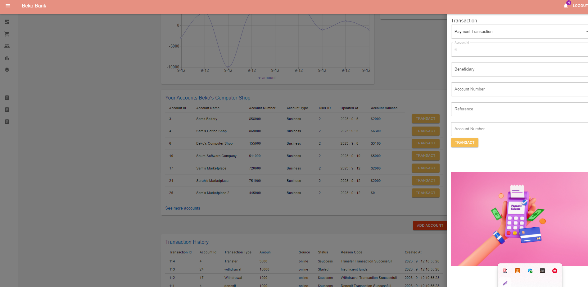

# Online Banking Java Full Stack Project 

This is a java full-stack project.


## Project Images and Components








  
## Features

- React and Redux
- Single Page Application
- Material UI

  
## Distribution

1- Clone the project to your local machine.
2- Build and run the application using your preferred Java Script environment.

Start for Project

```terminal
  npm install
```

```bash
  npm run start
```

  
## Technologies

**Language:** Java Script 

**Technologies:** - React, Redux, Router Dom
- Redux Thunk


  
